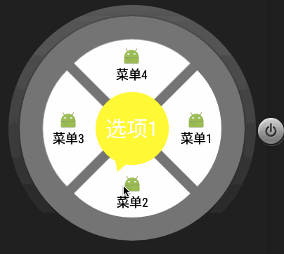

# WheelView

> 转盘指示器




### 使用
+ 布局

 ```
 <com.fjc.library.WheelView
        android:id="@+id/wheelView"
        android:layout_width="match_parent"
        android:layout_height="match_parent"
        app:centerTextSize="18sp"
        app:color="@color/red"
        app:menuTextSize="20sp"
        app:num="5"
        app:text="指示器" />
 ```

+ 属性
    - num: 选项数量
    - text: 指示器文本
    - color: 指示器颜色
    - menuColor: 选项背景色
    - centerTextColor: 指示器文本颜色
    - selectMenuColor: 选项按压时背景色
    - menuTextColor: 选项文本颜色
    - menuTextSize: 选项文本字体大小
    - centerTextSize: 指示器文本字体大小
+ 代码

  ```
  //设置选择器菜单内容
  String[] strs = {"菜单1", "菜单2", "菜单3", "菜单4"};
  int[] imgs = {R.drawable.menu1,R.drawable.menu2,R.drawable.menu3,R.drawable.menu4};
  wheelView.setMenu(strs, imgs);
  //选择监听器
  wheelView.setOnCheckListener(new WheelView.OnCheckListener() {
           @Override
           public void onCheck(int position) {
              // do something;
           }
       });
  //指示器从当前颜色变化到红色
  wheelView.startColorAnimation(Color.RED);
  //指示器从红色变化到绿色
  wheelView.startColorAnimation(Color.RED,Color.GREEN);
  //指示器按颜色数组顺序渐变
  int[] colors={Color.RED,Color.GREEN,Color.WHITE}
  wheelView.startColorAnimation(colors);
  ```  


### 解析
+ 绘制
  ```
  @Override
   protected void onDraw(Canvas canvas) {
       super.onDraw(canvas);
       int r = witdh > height ? height / 2 : witdh / 2;
       // 扇形半径
       int r1 = (int) (r * r1_xishu);
       // 指示器半径
       int r2 = (int) (r * r2_xishu);
       Paint paint = new Paint();
       paint.setStrokeWidth(3);
       paint.setAntiAlias(true);
       paint.setStyle(Paint.Style.FILL);
       // 画扇形
       for (int i = 0; i < num; i++) {
           // 默认颜色
           paint.setColor(menuColor);
           // 按下的menu背景变色
           if (touchId == i) {
               paint.setColor(selectedMenuColor);
           }
           // 根据id计算弧度
           double pencent = (Math.PI * i / num * 2);
           // 扇形圆心与控件中心的偏移量
           int deltaX = (int) (delta * Math.cos(pencent));
           int deltaY = (int) (delta * Math.sin(pencent));

           RectF oval = new RectF();                     //RectF对象
           oval.left = witdh / 2 - r1 + deltaX;
           oval.top = height / 2 - r1 + deltaY;
           oval.right = witdh / 2 + r1 + deltaX;
           oval.bottom = height / 2 + r1 + deltaY;
           canvas.drawArc(oval, (float) ((i - 0.5) / (float) num * 360), 1 / (float) num * 360, true, paint);
       }
       paint.setStyle(Paint.Style.FILL);//设置实心
       // 设置为指示器颜色
       paint.setColor(color);
       // 画圆
       canvas.drawCircle(witdh / 2, height / 2, (float) (r2), paint);
       // 画三角形
       canvas.drawPath(getTrianglePath(angle, (int) (r2 / 0.8)), paint);
   }
  ```
    1. 绘制四个扇形，扇形半径为r1，但是为了制造出缝隙，需要将扇形圆心在控件中心基础上加一个偏移量（这个偏移量不等于缝隙的宽度）
    2. drawCircle绘制指示器的圆
    3. drawPath绘制指示器尖角，`r2 / 0.8`是因为尖角所在圆的半径比指示器的圆的半径略大

  ```
      private Path getTrianglePath(float i, int r) {

          //角度转弧度
          double angel = Math.PI * i / 180;
          int pointX = witdh / 2;
          int pointY = height / 2;

          //第一个点,指针尖角
          double x1 = Math.cos(angel) * r + pointX;
          double y1 = Math.sin(angel) * r + pointY;

          //默认指针尖角60度
          double a1 = Math.PI * (i + 180 + 30) / 180;
          double a2 = Math.PI * (i + 180 - 30) / 180;

          //三角形边长,边长不能太小,否则不能被圆覆盖住两角
          double aa = 0.3 * r;

          //第二个点
          double x2 = Math.cos(a1) * aa + x1;
          double y2 = Math.sin(a1) * aa + y1;

          //第三个点
          double x3 = Math.cos(a2) * aa + x1;
          double y3 = Math.sin(a2) * aa + y1;

          Path path = new Path();
          path.moveTo((float) x1, (float) y1);
          path.lineTo((float) x2, (float) y2);
          path.lineTo((float) x3, (float) y3);
          path.close();

          return path;
      }
  ```
    > 尖角画了一个等边三角形，其中尖角为60度，其中a1，a2是其他两个角以尖角（x1，y1）为原点时的角度，以此计算sin和cos，sin、cos乘以边长aa就可以得到相对于（x1，y1）的坐标偏移值，以此确定两点坐标。


+ 触摸事件
   ```
   @Override
   public boolean onTouchEvent(MotionEvent event) {

       float x = event.getX();
       float y = event.getY();
       switch (event.getAction()) {
           case MotionEvent.ACTION_DOWN:
               touchId = getCheckId(x, y);
               break;
           case MotionEvent.ACTION_MOVE:
               // 手指移出扇形时取消
               if (getCheckId(x, y) != touchId) {
                   touchId = -1;
               }
               break;
           case MotionEvent.ACTION_UP:
               if (getCheckId(x, y) == touchId && touchId != -1) {
                   check(touchId);
               }
               touchId = -1;
               break;
       }
       //重新绘制
       invalidate();
       return true;
   }
   ```
   > 利用getCheckId方法获取当前手指触摸的选项

   ```
   private int getCheckId(float x, float y) {

       int index = -1;
       // 中心点坐标
       int potX = witdh / 2;
       int potY = height / 2;

       int r = potX > potY ? potY : potX;
       // r*r1_xishu是扇形的半径,r1是扇形拼成的大圆的半径,两者之间有delta偏移量
       int r1 = (int) (r * r1_xishu + delta);
       // 指示器半径
       int r2 = (int) (r * r2_xishu);

       if (Math.pow(x - potX, 2) + Math.pow(y - potY, 2) < Math.pow(r1, 2)
               && Math.pow(x - potX, 2) + Math.pow(y - potY, 2) > Math.pow(r2, 2)) {
           double delta_x = x - potX;
           double delta_y = y - potY;
           double r3 = Math.sqrt(Math.pow(delta_x, 2) + Math.pow(delta_y, 2));
           double sin = delta_y / r3;
           double cos = delta_x / r3;
           //求arcsin反三角 0-2pi 会有两值
           double angel1 = (Math.asin(sin) + 2 * Math.PI) % (2 * Math.PI);
           double angel2 = (3 * Math.PI - angel1) % (2 * Math.PI);
           double selectAngel = 0;
           // 利用cos确认 正确的角度值
           if (Math.cos(angel2) * cos > 0) {
               selectAngel = angel2;
           } else if (Math.cos(angel1) * cos > 0) {
               selectAngel = angel1;
           }
           // 弧度转角度
           double selectAngel2 = (selectAngel * 180 / Math.PI);
           // 根据角度算id
           index = (int) (selectAngel2 / (360 / (double) num) + 0.5) % num;

       }

       return index;
   }
   ```
     1. 先判断是不是在大圆和小圆之间。此时大圆的半径不是扇形半径（比扇形半径略大，需要加上偏移值）
     2. `delta_x``delta_y`是按压点相对于中心点的偏移值
     3. `double r3 = Math.sqrt(Math.pow(delta_x, 2) + Math.pow(delta_y, 2));`求出按压点距离控件中心的距离
     4. 求出sin，cos
     5. arcsin反三角求弧度，弧度范围在[-PI/2,PI/2]之间，所以在一个2PI周期里面有两个值，即代码中angel1，angel2
     6. 比较cos值来确定正确的弧度，其中angel1，angel2的cos符号相反。
     7. `index = (int) (selectAngel2 / (360 / (double) num) + 0.5) % num;`根据角度算出当前的id，为什么有0.5因为绘图时扇形角度整体偏移1/2。第一个扇形是关于x轴对称的，角度范围是（-360/num/2,360/num/2）。


+ 选择选项
  ```
  private void check(final int index) {
       if (colorAnimator != null) {
           colorAnimator.cancel();
       }
       AnimatorSet set = new AnimatorSet();

       // 计算目标角度
       float angle2 = index / (float) num * 360;
       // 使得每次旋转选取最近方向
       if (Math.abs(angle2 - angle) > 180) {
           if (angle2 > angle) {
               angle += 360;

           } else {
               angle2 += 360;
           }
       }
       // 旋转动画
       ObjectAnimator animator1 = ObjectAnimator.ofFloat(WheelView.this, "angle", angle, angle2);
       set.play(animator1);
       set.setDuration(rotateDuration);
       set.start();
       checkId = index;
       set.addListener(new Animator.AnimatorListener() {
           @Override
           public void onAnimationStart(Animator animator) {

           }

           @Override
           public void onAnimationEnd(Animator animator) {
               if (listener != null) {
                   listener.onCheck(index);
               }
           }

           @Override
           public void onAnimationCancel(Animator animator) {

           }

           @Override
           public void onAnimationRepeat(Animator animator) {
           }
       });
   }
  ```
    1. 计算目标角度`float angle2 = index / (float) num * 360;`
    2. 为了使转盘总是往最近方向转，需要给目标角度和当前角度中较小的角度加上360
    > 比如 从30度转到 270度，从优弧转即30-270，从劣弧转即390-270
    3. 转动完毕执行回调事件


+ 指示器颜色渐变
  ```
  public void startColorAnimation(int[] colors) {
       if (colorAnimator != null) {
           colorAnimator.cancel();
       }
       colorAnimator =
               ObjectAnimator.ofInt(WheelView.this, "color", colors);
       colorAnimator.setEvaluator(new ArgbEvaluator());
       colorAnimator.setDuration(colorDuration);
       colorAnimator.start();
   }
  ```
  > startColorAnimationz最终都是调用startColorAnimation(int[] colors) 这个方法。关于这个指示器颜色动画的使用，用户可以灵活选择执行的时间，执行的时长，执行的颜色。
